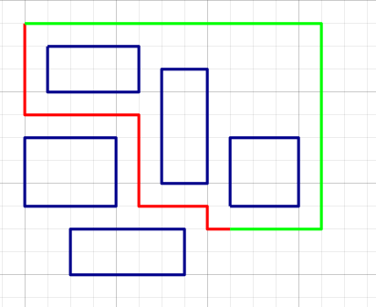
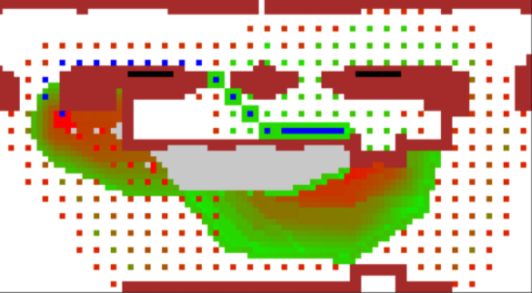
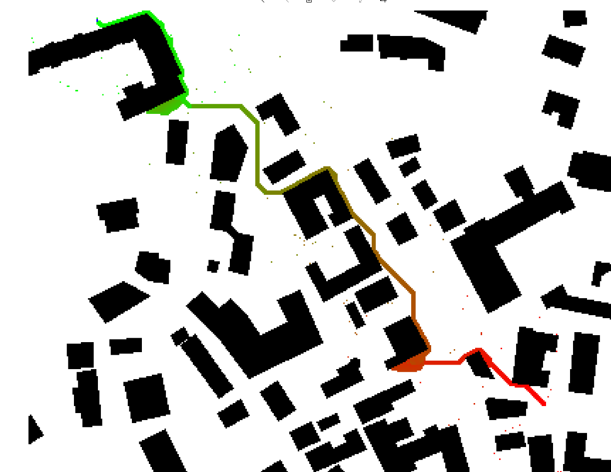

## Декомпозиция при поиске суб-оптимальных решений (R*, MRA*).
В данном репозитории реализованы два алгоритма производящих эвристический поиск суб-оптимального пути основанные на декомпозиции.


Реализованы R*[1] использующий прыжки в случайных направлениях и MRA*[2] использующий регулярную сетку.
### Установка
1. Скачайте репозиторий используя
> gh repo clone evjava/HeuristicsBetterThan

2. Установите необходимые пакеты при помощи
> pip install -e .

### Входные и выходные данные

#### Входные данные

На вход принимаются файлы в формате карт MovingAI[3]:
* Карта в формате <name>.map
* Список начальных и конечных точек в формате <name>.scen

#### Выходные данные
Результатом работы программы является тройка:
* Путь между начальной точкой(start) и конечной точкой(goal)
* Open - открытые в ходе исследования вершины
* Closed - раскрытые в ходе исследования вершины

### Гиперпараметры
R* имеет следующие гиперпараметры:
* heuristic - название используемой эвристики
* w - вес эвристики
* D - растояние до потомка
* K - количество потомков
* exp_coeff - максимальное количество допустимых раскрытий при поиске пути до потомка

MRA* имеет следующие гиперпараметры:
* heuristic - название используемой эвристики
* resolutions - список разрешений по которым производится поиск
* w_1 и w_2 - веса используемые при базовом и увеличенном разрешении
### Пример работы

Работа происходит через Pipeline. Следующий пример является исчерпывающим примером его работы

```
algorithms = [MRAstar(diagonal_dist, resolutions=(1, 3, 9), w_1=3, w_2=3),
    Rstar(diagonal_dist, D=30, K=10, w=3, exp_coeff=3)]
```
```
p = Pipeline(
> reader=MaiReader(map_name, number_of_tasks),
> algorithms=algorithms, 
> processor=Processor1().then(Processor2()),
> timelimit=sec)
```
Конкретные примеры могут быть найдены в папке examples

### Сравнение алгоритмов
Algorithm_comparation.ipynb содержит сравнения A*, WA*, R* и MRA* на различных картах

### Ссылки:
* Likhachev, M.; and Stentz, A. 2008. R* Search. In Proceedings of the 23rd AAAI Conference on Artificial Intelligence, AAAI 2008 (pp. 344-350).
https://www.aaai.org/Papers/AAAI/2008/AAAI08-054.pdf
* Du, W., Islam, F. and Likhachev, M., 2020. Multi-resolution A. In Proceedings of the 13th International Symposium on Combinatorial Search, SoCS 2020. (pp. 29-37).
https://aaai.org/ocs/index.php/SOCS/SOCS20/paper/viewFile/18515/17554
* Benchmarks for Grid-Based Pathfinding, Transactions on Computational Intelligence and AI in Games, 2012, http://web.cs.du.edu/~sturtevant/papers/benchmarks.pdf


